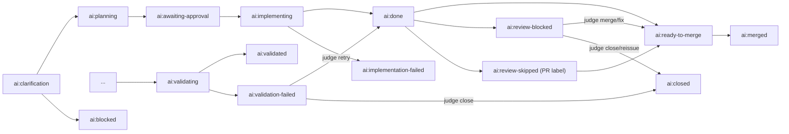

# How it works

The optional structured issue form and the default free-form issue path both enter the same clarify-first pipeline, so the state machine below describes the shared issue → PR flow.

## Pipeline overview

The primary issue → PR pipeline spans twelve core phases: clarify (`clarify.yml`, `internal-clarify.yml`), clarify-respond (`orchestrate_clarify_respond.yml`, `internal-orchestrate-clarify-respond.yml`), plan (`plan.yml`, `internal-plan.yml`), implement (`implement.yml`, `internal-implement.yml`), implement-diagnose (`scripts/implement_diagnose_post_codex_failure.sh`), implement-repair (`prompts/mode-implement-repair.txt`, `prompts/mode-implement-repair-syntax.txt`), review autofix (`review_autofix.yml`, `internal-review.yml`), conflict resolver (`scripts/review_conflict_resolve.sh` inside review autofix), orchestrate (`orchestrate.yml`, `internal-orchestrate.yml`, `orchestrate_poll.yml`, `internal-orchestrate-poll.yml`), judge (`prompts/mode-judge*.txt` plus `scripts/review_rb_judge.sh` in review-blocked recovery), validate (`validate.yml`, `internal-validate.yml`), and workflow log analysis (`workflow-log-analysis.yml`); the separate `check_failure_triage.yml` path is adjacent automation, but not part of the main issue-state machine below.

## Label state machine

The diagram focuses on the main issue-phase labels from `.github/ai/label_contract.v1.json`. `ai:review-skipped` is shown because it is a PR-side label that changes the linked issue's next transition.



ASCII fallback:

```text
Happy path
  ai:clarification -> ai:planning -> ai:awaiting-approval -> ai:implementing
  -> ai:done -> ai:ready-to-merge -> ai:merged

Validation branch
  ... -> ai:validating -> ai:validated
  ... -> ai:validating -> ai:validation-failed -> judge -> ai:done
  ... -> ai:validating -> ai:validation-failed -> judge -> ai:closed

Review and error branches
  ai:clarification -> ai:blocked
  ai:implementing -> ai:implementation-failed
  ai:done -> ai:review-blocked -> judge -> ai:ready-to-merge
  ai:done -> ai:review-blocked -> judge -> ai:closed
  ai:done -> ai:review-skipped (PR label) -> ai:ready-to-merge
```

Other live contract labels support recovery, diagnostics, or side channels rather than the main happy path above, including `ai:validation-fixing`, `ai:validation-recovery`, `ai:needs-human`, `ai:resolver-escalated`, `ai:harness-broken`, and per-phase failure labels such as `ai:clarify-failed`, `ai:plan-failed`, `ai:review-autofix-failed`, and `ai:validate-failed`.

## Command vocabulary

| Command / surface | Where it appears | Consumed by | Transition or effect | Idempotency / dedupe key |
| --- | --- | --- | --- | --- |
| `/reclarify` | Issue comment | `.github/workflows/clarify.yml` | Re-enters `ai:clarification`; on comment-triggered reruns it removes stale `ai:planning`, `ai:awaiting-approval`, `ai:implementing`, and `ai:done` labels first. | Workflow concurrency group `ai-clarify-<issue-number>`; a newer `/reclarify` cancels the older clarify run. |
| `/answer` | Issue comment | `.github/workflows/plan.yml` | Moves `ai:clarification` or `ai:blocked` into `ai:planning`; on success the plan flow advances to `ai:awaiting-approval` and may auto-post `/approved`. | `processed_command_<issue>_<comment>_answer` via `make_processed_command_entry_id(issue_number, comment_id, command)`. |
| `/approved` | Issue comment | `.github/workflows/implement.yml` | Moves `ai:awaiting-approval` into `ai:implementing`; a successful implementation PR then advances the issue to `ai:done`. | `processed_command_<issue>_<comment>_approved`. |
| `/clarify-now` | Issue comment | No checked-in consumer on this ref | Reserved / unwired on the current branch; no live state transition was found in the checked-in workflows or scripts. | n/a |
| `[judge-fix]` | Commit subject on the PR branch | `scripts/review_rb_judge.sh` and `.github/workflows/review_autofix.yml` | Applies review-blocked fixes chosen by the judge so the issue can re-enter the review path and eventually reach `ai:ready-to-merge`. | Retry tracking counts `[judge-fix]` commits in branch history (`judge_fix_count`); there is no comment-level processed-command key. |
| `[ai-autofix]` | Commit subject on the PR branch | `.github/workflows/review_autofix.yml` | Continues the autofix loop while the PR stays under review. | Self-trigger suppression keys off PR head SHA plus GitHub-attributed bot identity; iteration tracking counts consecutive first-parent `[ai-autofix]` commits. |
| `[ai-merge-resolve]` | Commit subject on the PR branch | `scripts/review_conflict_resolve.sh` and `.github/workflows/review_autofix.yml` | Records conflict-resolution output, then re-runs reviewer coverage on the resolved PR head. | `AUTOFIX_RESOLVER_RETRY_STATE_V1` persisted in the PR body, keyed by PR head SHA plus the normalized failure signature. |
| `[force-review]` | PR title | `.github/workflows/review_autofix.yml` | Bypasses the deterministic review-skip gate so the full review/autofix path runs instead of labeling the PR `ai:review-skipped`. | Presence of the literal `[force-review]` title token at gate time. |
| `force-review` | PR label | `.github/workflows/review_autofix.yml` | Same deterministic-skip bypass as the title token. | Presence of the `force-review` label at gate time. |

There is no checked-in unbracketed `force-review` PR-title consumer on this ref; the live title token is `[force-review]`.

## Stall recovery ladder

The per-phase stall schedule lives in the `STALL_THRESHOLD_*` rows of [README.md](../README.md#required-variables). The declarative recovery ladder itself lives in [`STALL_RECOVERY_ACTIONS`](../scripts/orchestrate_lib.py) inside `scripts/orchestrate_lib.py`, with `run_stall_judge` escalation layered on top after the configured retry count. Read those two sources together: the README answers when the poller intervenes, and `orchestrate_lib.py` answers what it tries next.

## Source

Structurally inspired by `hesreallyhim/awesome-claude-code`'s `docs/HOW_IT_WORKS.md`, but this repository runs a much richer state machine: twelve core phases plus validation/review sub-states rather than an upstream four-state label flow.
